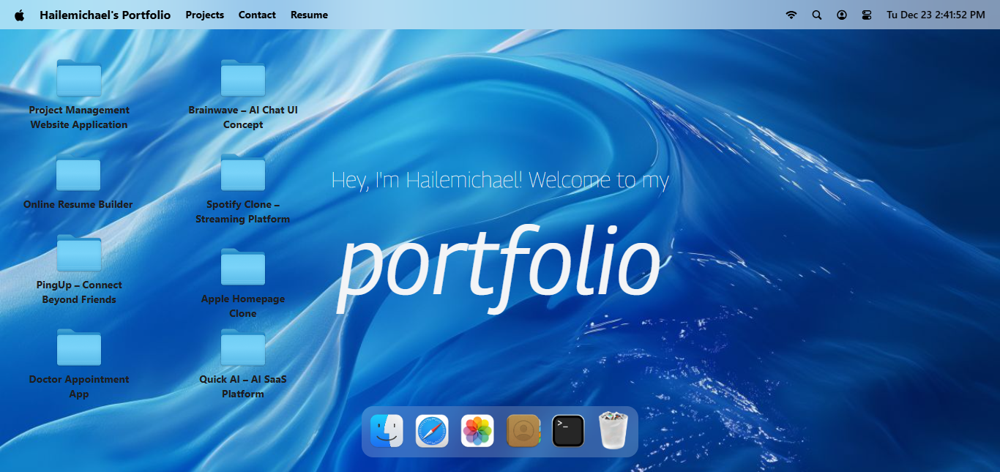
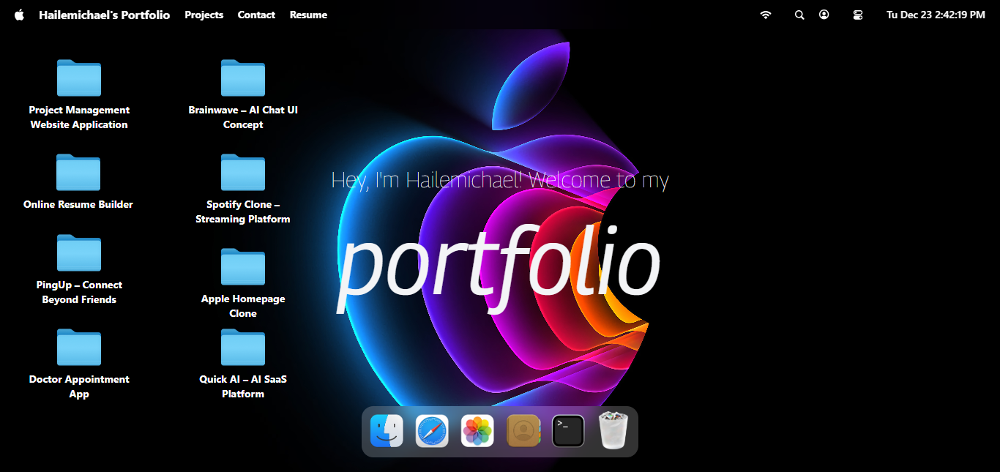
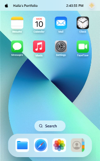
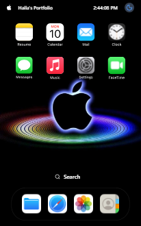

<div align="center">

# VantaDesk — Interactive macOS‑Style Developer Portfolio ✨

A compact, macOS‑inspired portfolio that showcases projects inside a familiar desktop-like interface — optimized for clarity, interactivity, and developer presentation.

<!-- Badges -->

         

</div>

## About the Project 🧩

VantaDesk recreates a lightweight macOS-style desktop experience to present projects, media, and contact information in an immersive, developer-focused UI.

- Component-driven architecture with isolated, reusable windows
- Desktop-style window management, dock, and app-like interactions
- Fast, Vite-powered dev experience with smooth GSAP animations
- Responsive and accessible by design for desktop and mobile

## Why VantaDesk?

VantaDesk blends familiar desktop metaphors with a component-first approach so developers can present work in an engaging, interactive format while keeping the codebase modular and maintainable.

## Features ✨

- Desktop-style window manager and dock
- Responsive layout for mobile & desktop
- Modular React components for windows, gallery, terminal, and finder
- Lightweight, Vite-powered dev workflow
- Accessible keyboard navigation and focus handling
- Easy to extend with new "apps" (projects)

## Tech Stack ⚙️

- Frontend: React (JSX)
- Bundler: Vite
- Styling: Tailwind CSS
- Animation: GSAP
- State Management: Zustand + Immer
- Hosting: Vercel
- Dev Tools: VS Code, Git, GitHub

## Installation & Setup (VS Code + GitHub Copilot) 🛠️

1. Clone

```bash
git clone https://github.com/hilla10/MacOS_Portfolio
cd MacOS_Portfolio
```

2. Install

```bash
npm install
```

3. Run (dev)

```bash
npm run dev
```

Recommended VS Code extensions: ES7+ React/Redux snippets, Prettier, EditorConfig, GitHub Copilot.

## Usage 💻

- Start the dev server: `npm run dev`
- Open the app at the local Vite URL shown in terminal
- Interact with the dock and open windows to view projects, images, and terminal demos
- Add new windows by creating components under `src/windows` and registering them in the app index

## Live Demo 🌐

Visit the live site: https://portfolio-rho-gules-15.vercel.app/

## Screenshots 📸

## 📸 Screenshots

Overview of the application's responsive design and theming capabilities.

### Desktop View

The desktop interface features a spacious layout optimized for productivity and ease of navigation.

|                                Light Mode                                |                               Dark Mode                                |
| :----------------------------------------------------------------------: | :--------------------------------------------------------------------: |
|  |  |
|                    _Clean, high-contrast light theme_                    |                  _Immersive, eye-friendly dark theme_                  |

### Mobile View

The mobile interface is fully responsive, ensuring a seamless user experience on smaller screens.

|                               Light Mode                               |                              Dark Mode                               |
| :--------------------------------------------------------------------: | :------------------------------------------------------------------: |
|  |  |
|                   _Optimized mobile layout (Light)_                    |                   _Optimized mobile layout (Dark)_                   |

---

> **Note:** The images displayed above are located in the `/public/images` directory. As the project evolves, these screenshots can be updated by simply replacing the files with new captures while maintaining the existing filenames.

## 🗺️ Roadmap

- Add customizable themes (dark/light and accent color options)
- Project import/export to add new portfolio "apps" via JSON
- Additional accessibility improvements and keyboard shortcuts
- CI/CD preview deployments for pull requests (Vercel integration)

## 🙏 Acknowledgements

- JavaScript Mastery :https://www.youtube.com/@javascriptmastery
- macOS UI paradigms for design inspiration
- GSAP for smooth animations
- Tailwind CSS for rapid, consistent styling
- Vercel for hosting and deployment

## Author 🧑‍💻

- Name: Hailemichael Nigusse
- Email: hillaman592@gmail.com
- Portfolio (Live Demo): https://portfolio-rho-gules-15.vercel.app/
- LinkedIn: https://www.linkedin.com/in/hailemichaelnegusse/

## Contributing 🤝

- Fork the repo and create a feature branch: `git checkout -b feat/new-window`
- Make focused, well-tested commits
- Open a pull request with a clear summary and screenshots
- Follow the existing component style and naming conventions
- For major changes, open an issue first to discuss design/approach

## Support 💬

For questions or support, contact: hillaman592@gmail.com — include "VantaDesk" in the subject.

## License 📄

This project is licensed under the MIT License — see the LICENSE file for details.
